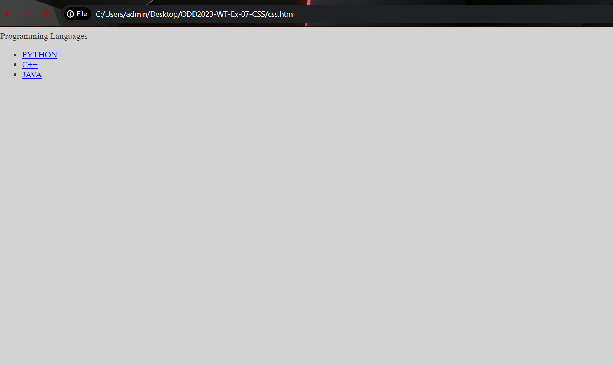
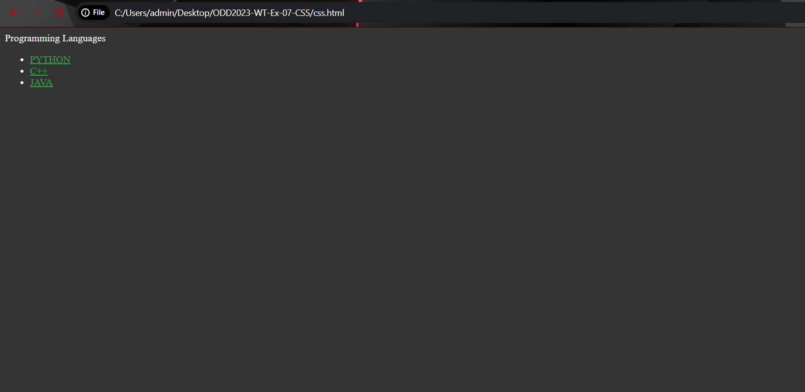
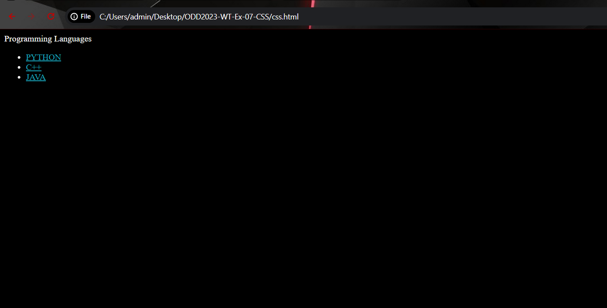
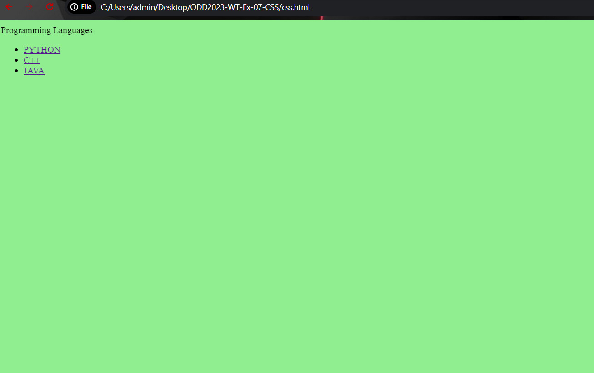
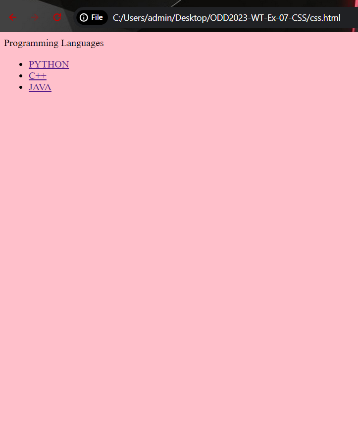
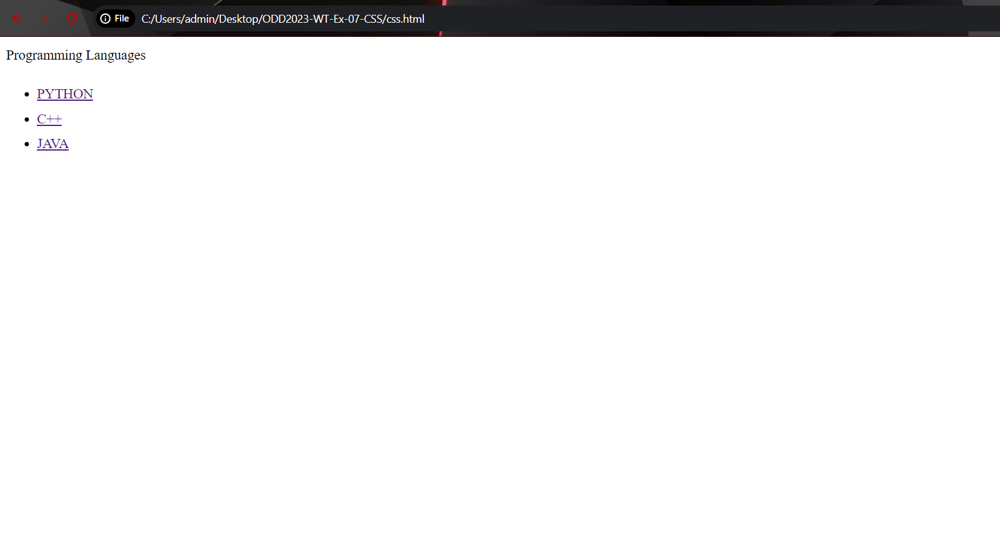
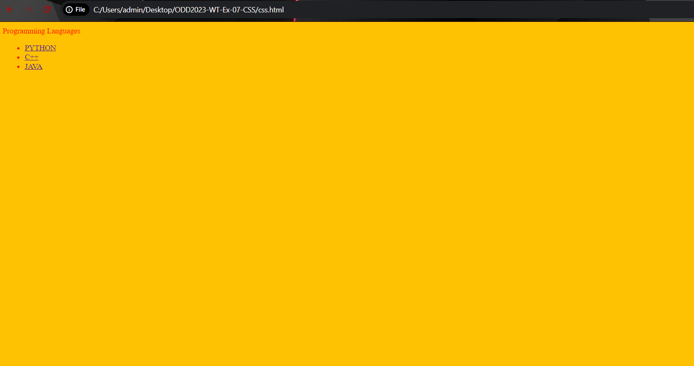
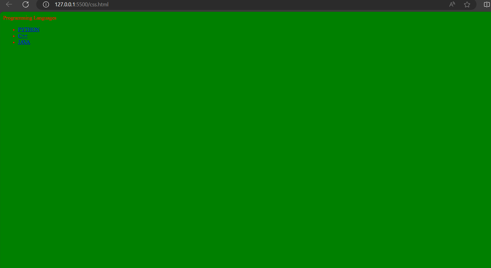

# Ex-07-CSS
# QUESTION 1:
# AIM:
To use CSS media queries, modify the webpage's color scheme with the following requirements:
Default Color Scheme:
Background color: Light gray (#f4f4f4)
Text color: Dark gray (#333)
Link color: Blue (#007bff)
Small Screen Adaptation (Max-width: 600px):
Change the background color to dark gray (#333)
Change the text color to light gray (#f4f4f4)
Change the link color to light green (#28a745)
Dark Mode Preference:
If the user has set their device to dark mode, override the above styles with the following:
Background color: Black (#000)
Text color: White (#fff)
Link color: Cyan (#17a2b8)

# DESIGN STEPS:
# Step 1: Create an HTML structure
Create the HTML structure for your webpage.

# Step 2: Set default styles
In your CSS file define the default color scheme for the webpage.

# Step 3: Implement small screen application
Within your CSS file, use a media query to adjust styles for small screens (max-width: 600px).

# Step 4: Implement dark mode preference
Still in your CSS file, apply another media query to override styles for devices set to dark mode.

# Step 5: Add content
In your HTML file, add your webpage content within the body tag.

# Step 6: End the code
End the HTML code by closing the open tags.

# CODE:
```<!DOCTYPE html>
<html>
<head>
<title>Question 1:</title>
<style>
body {
 background-color: #f4f4f4;
 color: #333;
}
a {
 color: #007bff;
}
@media (prefers-color-scheme: light) and (max-width: 600px) {
 body {
  background-color: #333;
  color: #f4f4f4;
  }
 a {
   color: #28a745;
  }
}
@media (prefers-color-scheme: dark) {
body {
 background-color: #000;
 color: #fff;
 }
 a {
 color: #17a2b8;
 }
}
</style>
</head>
<body>
<div>Programming Languages</div>
<ul>
<li><a href="https://www.w3schools.com/python/default.asp">PYTHON</a></li>
<li><a href="https://www.w3schools.com/cpp/default.asp">C++</a></li>
<li><a href="https://www.w3schools.com/java/default.asp">JAVA</a></li>
</ul>
</body>
</html>
```
# OUTPUT:


 

# QUESTION 2: 
# AIM:
To use a media query in CSS to apply different styles to a webpage for mobile devices (with widths less than 600px) and desktop devices (with widths greater than or equal to 600px) and to provide an example CSS snippet to demonstrate your answer.

# DESIGN STEPS:
# Step 1: Create an HTML structure
Create the HTML code with root element.

# Step 2: Set default styles
Set the default styles for your webpage that will be applied to all devices.

# Step 3: Apply media query for mobile devices (Max-width: 600px)
Use a media query to adjust styles as needed for a mobile friendly layout.

# Step 4: Apply media query for desktop devices (Min-width: 601px)
Use another media query to adjust styles for a larger screen.

# Step 5: End the code
End the HTML code by closing the open tags.

# CODE:

```<!DOCTYPE html>
<html>
<head>
<title>Question 2:</title>
<style>
@media only screen and (max-width: 599px) {
  body {
    background-color: lightblue;
    font-size: 14px;
  }
}
@media only screen and (min-width: 600px) {
  body {
    background-color: lightgreen;
    font-size: 16px;
  }
}
</style>
</head>
<body>
<div>Saveetha Engineering College</div>
<ul>
<li><a href="https://www.w3schools.com/python/default.asp">PYTHON</a></li>
<li><a href="https://www.w3schools.com/cpp/default.asp">C++</a></li>
<li><a href="https://www.w3schools.com/java/default.asp">JAVA</a></li>
</ul>
</body>
</html>
```
# OUTPUT:




# QUESTION 3: ORIENTATION-BASED MEDIA QUERY
# AIM:
To use CSS media queries to apply different styles based on the orientation (landscape or portrait) of the device and to provide a CSS example where you change the background color of the body based on the orientation.

# DESIGN STEPS:
# Step 1: Create an HTML structure
Create the HTML code with root element.

# Step 2: Set default styles
Define default styles to your webpage.

# Step 3: Apply media query for landscape orientation
Use a media query to target devices in landscape orientation and adjust styles accordingly

# Step 4: Apply media query for portrait orientation
Use another media query to target devices in portrait orientation and adjust styles accordingly

# Step 5: End the code
End the HTML code by closing the open tags.

# CODE:
```
<!DOCTYPE html>
<html>
<head>
<title>Question 3:</title>
<style>
@media only screen and (orientation: portrait) {
  body {
    background-color: teal;
    color: black;
  }
}
@media only screen and (orientation: landscape) {
  body {
    background-color: royalblue;
    color: black;
  }
}
</style>
</head>
<body>
<div>Saveetha Engineering College</div>
<ul>
<li><a href="https://www.w3schools.com/python/default.asp">PYTHON</a></li>
<li><a href="https://www.w3schools.com/cpp/default.asp">C++</a></li>
<li><a href="https://www.w3schools.com/java/default.asp">JAVA</a></li>
</ul>
</body>
</html>
```
# OUTPUT:


# QUESTION 4: RESPONSIVE TYPOGRAPHY
# AIM:
To would use media queries to adjust typography (like font size and line spacing) on a website to improve readability across different device sizes, from mobile phones to large desktop monitors.

# DESIGN STEPS:
# Step 1: Create an HTML structure
Create the HTML code with root element.

# Step 2: Define default typography styles
Define default typography styles to your webpage.

# Step 3: Apply media query for small screens (mobiles)
Use a media query to adjust font size and line spacing for small screens like mobiles.

# Step 4: Apply media query for medium screens (tablets)
Use another media query to adjust font size and line spacing for medium screens like tablets.

# Step 5: Apply media query for medium screens (desktop)
Use another media query to adjust font size and line spacing for large screens like desktops.

# Step 6: End the code
End the HTML code by closing the open tags.

# CODE:
```
<!DOCTYPE html>
<html>
<head>
<title>Question 4:</title>
<style>
@media only screen and (max-width: 767px) {
  body {
    font-size: 14px;
    line-height: 1.4;
  }
  h1 {
    font-size: 24px;
  }
}
@media only screen and (min-width: 768px) {
  body {
    font-size: 16px;
    line-height: 1.6;
  }

  h1 {
    font-size: 36px;
  }
}
@media only screen and (min-width: 1200px) {
  body {
    font-size: 18px;
    line-height: 1.8;
  }

  h1 {
    font-size: 48px;
  }
}
</style>
</head>
<body>
<div>Programming Languages</div>
<ul>
<li><a href="https://www.w3schools.com/python/default.asp">PYTHON</a></li>
<li><a href="https://www.w3schools.com/cpp/default.asp">C++</a></li>
<li><a href="https://www.w3schools.com/java/default.asp">JAVA</a></li>
</ul>
</body>
</html>
```
# OUTPUT:



# QUESTION 5: PRINT-FRIENDLY CSS
# AIM:
Media queries can be used to provide print-friendly styles for web pages. To use a media query to change the styling of a webpage when it is printed, such as changing the background to white and hiding non-essential elements and provide a CSS example.

# DESIGN STEPS:
# Step 1: Create an HTML structure
Create the HTML code with root element.

# Step 2: Set default styles
Define the default styles for your webpage.

# Step 3: Apply media query for print styles
Use a media query to modify the appearance of the page when its printed.

# Step 4: End the code
End the HTML code by closing the open tags.

# CODE:
```
<html>
<head>
<title>Question 05:</title>
<style type="text/css">
    div, li {
        font-size: 14px;
        line-height: 1;
    }

    @media print {
        body {
            background-color: white;
        }

        div, li {
            font-size: 12px;
            line-height: 1.4;
        }

        
        .non-essential {
            display: none;
        }
    }
</style>
</head>
<body>
<div>
Programming Languages
</div>
<ul>
<li><a href="https://www.w3schools.com/python/default.asp">PYTHON</a></li>
<li><a href="https://www.w3schools.com/cpp/default.asp">C++</a></li>
<li><a href="https://www.w3schools.com/java/default.asp">JAVA</a></li>
</ul>
</body>
</html>
```

# OUTPUT:


# QUESTION 6: DARK MODE IMPLEMENTAION
# AIM:
To use a media query to detect if the user has set their system to prefer a dark color scheme and to provide an example of how to change the background and text colors of a website based on this preference.

# DESIGN STEPS:
# Step 1: Create an HTML structure
Create the HTML structure for your webpage.

# Step 2: Set default styles
In your CSS file define the default color scheme for the webpage.

# Step 3: Apply media query for dark mode preference
Use a media query to detect if the user has set their system to dark mode.

# Step 4: Apply media query for light mode preference
Use another media query to detect if the user has set their system to light mode.

# Step 5: End the code
End the HTML code by closing the open tags.

# CODE:
```
<!Doctype html>
<html>
<head>
<style>
@media screen and (prefers-color-scheme:dark) 
{
	body{
          background-color: #FFC203;
          color: red;
	  font-size: 14px;

}
}
@media screen and (prefers-color-scheme:light)
{
body
{
background-color: #03FF5B;
color: #DF5755;
font-size=16px;
}
}

</style>
</head>
<body>
<div>Programming Languages</div>
<ul>
li><a href="https://www.w3schools.com/python/default.asp">PYTHON</a></li>
<li><a href="https://www.w3schools.com/cpp/default.asp">C++</a></li>
<li><a href="https://www.w3schools.com/java/default.asp">JAVA</a></li>
</ul>
</body>
</html>
```
# OUTPUT:


